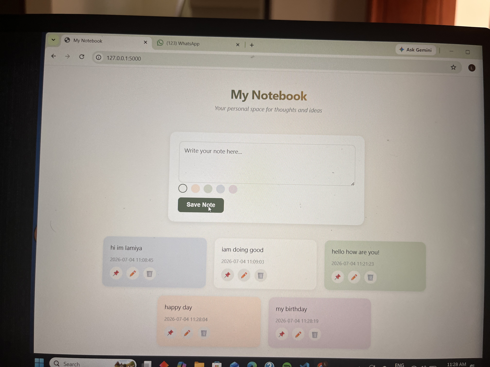
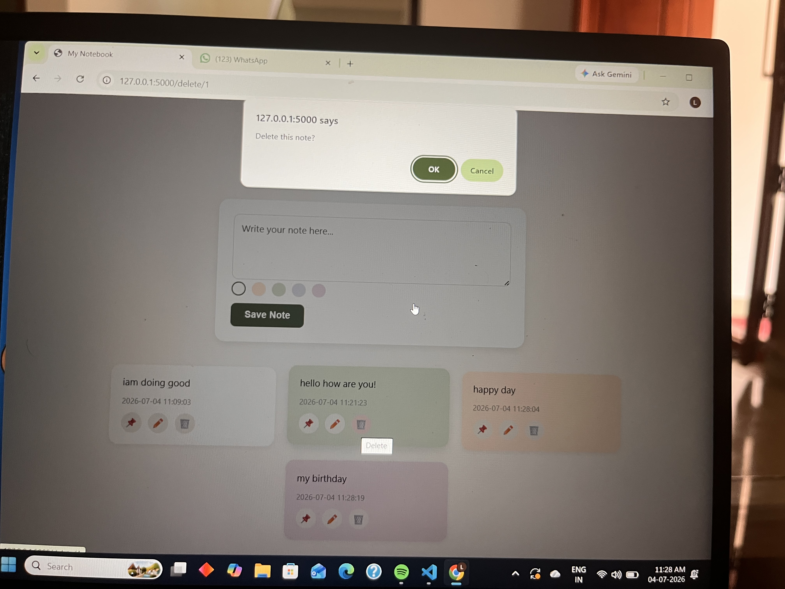
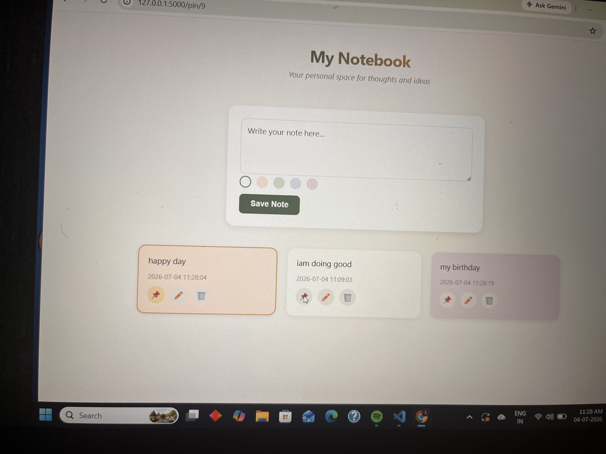

# My Notebook — Flask Web App

A simple, aesthetic note-taking web app built with Flask, featuring full CRUD functionality, persistent storage, and a Pinterest-style card layout.

## Features
- Create, edit, and delete notes
- Pin important notes to the top
- Color-tag notes (5 pastel options)
- Timestamps on every note
- Persistent storage using JSON (notes survive server restarts)
- Input validation (prevents empty notes)
- Responsive, card-grid UI with hover animations

## Tech Stack
- Python (Flask)
- HTML, CSS, Jinja2 templating
- JSON file storage

## How to Run Locally
1. Clone this repository
2. Create a virtual environment: `python -m venv venv`
3. Activate it: `venv\Scripts\Activate` (Windows) or `source venv/bin/activate` (Mac/Linux)
4. Install dependencies: `pip install flask`
5. Run the app: `python app.py`
6. Open your browser at `http://127.0.0.1:5000`

## Screenshots

by

## Author
Lamiya — B.Tech ECE Graduate | Aspiring Embedded Systems/IoT Engineer
